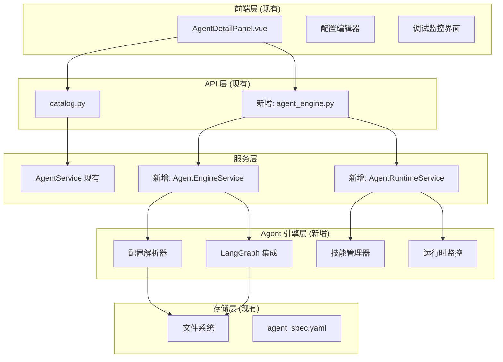

## 用户需求

基于现有的 LocalBrisk 桌面应用系统，实现用户自定义本地 Agent 系统的完整工作流程。

## 产品概述

在现有的 Python+Tauri+Vue 架构基础上，集成 LangGraph 框架构建本地 Agent 引擎，为用户提供从配置到运行的完整 Agent 生命周期管理。

## 核心功能

- **Agent 配置解析与验证**：基于 agent_spec.yaml 规范解析用户配置，进行完整性和有效性验证
- **Agent 调试运行**：提供实时调试环境，支持单步执行、日志监控和错误诊断
- **Agent 常驻服务**：将测试通过的 Agent 发布为后台常驻服务，支持并发执行和资源管理
- **LangGraph 集成**：基于 LangGraph 框架实现 Agent 图构建、状态管理和执行调度
- **技能动态加载**：支持 native_skills 和 mcp_tools 的动态加载和管理
- **运行时监控**：提供 Agent 执行状态、性能指标和错误日志的实时监控

## 技术栈选择

基于现有项目架构，保持技术栈一致性：

- **后端框架**：Python FastAPI（现有架构）
- **Agent 引擎**：LangGraph（优先选择，生态成熟，与 LangChain 兼容）
- **前端框架**：Vue 3 + TypeScript + Tailwind CSS（现有技术栈，无需修改）
- **桌面框架**：Tauri 2.0 + Rust（现有架构）
- **配置解析**：PyYAML（现有依赖）
- **数据处理**：Polars + DuckDB（现有依赖）
- **异步处理**：asyncio + FastAPI BackgroundTasks

## 实现方案

### 核心策略

基于现有的 `app/services` 架构模式，新增 `agent_engine` 模块作为 Agent 运行时引擎。利用现有的 Agent 配置解析能力（`AgentService`），扩展支持 LangGraph 图构建和执行调度。前端已有完整的 Agent 管理界面，重点实现后端 Agent 引擎核心功能。

### 关键技术决策

1. **选择 LangGraph 而非 DeepAgents**：LangGraph 生态更成熟，与现有 LangChain 生态兼容性更好，文档完善
2. **复用现有服务架构**：基于 `BaseService` 模式实现 `AgentEngineService`，保持代码风格一致
3. **异步执行模式**：使用 FastAPI BackgroundTasks 实现 Agent 异步执行，避免阻塞主线程
4. **状态持久化**：利用现有的文件系统存储 Agent 运行状态和日志

### 性能与可靠性

- **并发控制**：使用 asyncio.Semaphore 限制并发 Agent 数量，防止资源耗尽
- **错误隔离**：每个 Agent 实例独立运行，异常不影响其他 Agent
- **资源监控**：实时监控内存、CPU 使用情况，支持资源限制和自动回收
- **日志管理**：结构化日志输出，支持日志轮转和查询

## 实现细节

### 核心执行流程

1. **配置解析**：解析 agent_spec.yaml，验证配置完整性
2. **图构建**：基于配置构建 LangGraph 执行图
3. **运行时创建**：初始化 Agent 运行时环境
4. **执行调度**：启动 Agent 执行，处理输入输出
5. **状态管理**：维护 Agent 执行状态和上下文

### 日志与监控

- 复用现有 logger 配置，按 Agent 实例分类日志
- 避免敏感信息泄露，对输入输出进行脱敏处理
- 实时状态更新，支持前端实时监控

### 向后兼容性

- 保持现有 API 接口不变，新增 Agent 引擎相关端点
- 不修改现有数据模型，扩展支持运行时状态字段
- 渐进式集成，不影响现有功能

## 架构设计

### 系统架构

采用分层架构模式，在现有架构基础上新增 Agent 引擎层：



### 模块职责

- **AgentEngineService**：Agent 引擎核心服务，负责配置解析、图构建和生命周期管理
- **AgentRuntimeService**：Agent 运行时服务，负责实例管理、状态监控和资源控制
- **ConfigParser**：配置解析器，验证 agent_spec.yaml 完整性
- **GraphBuilder**：LangGraph 图构建器，将配置转换为执行图
- **SkillManager**：技能管理器，动态加载和管理 native_skills
- **RuntimeMonitor**：运行时监控器，收集性能指标和状态信息

## 目录结构

### 目录结构概述

基于现有项目架构，在 `backend/agent_engine/` 目录下实现 Agent 引擎核心功能。新增的模块将与现有服务层无缝集成，通过 API 层为前端提供 Agent 调试和运行服务。

```
backend/
├── agent_engine/
│   ├── __init__.py                    # [MODIFY] 导出核心类和函数
│   ├── core/
│   │   ├── __init__.py               # [NEW] 核心模块导出
│   │   ├── config_parser.py          # [NEW] Agent 配置解析器。解析和验证 agent_spec.yaml 文件，将 YAML 配置转换为 Python 数据模型，进行配置完整性检查和字段验证。支持配置热重载和版本兼容性检查。
│   │   ├── graph_builder.py          # [NEW] LangGraph 图构建器。基于 Agent 配置构建 LangGraph 执行图，处理节点创建、边连接和状态管理。支持条件路由、循环控制和错误处理节点的自动生成。
│   │   ├── skill_manager.py          # [NEW] 技能管理器。动态加载和管理 native_skills，支持技能的注册、卸载和版本管理。处理技能依赖关系和冲突检测，提供技能执行的沙箱环境。
│   │   └── runtime_monitor.py        # [NEW] 运行时监控器。实时收集 Agent 执行状态、性能指标和资源使用情况。提供日志聚合、错误追踪和性能分析功能，支持告警和自动恢复机制。
│   ├── models/
│   │   ├── __init__.py               # [NEW] 数据模型导出
│   │   ├── agent_runtime.py          # [NEW] Agent 运行时数据模型。定义 AgentInstance、ExecutionState、RuntimeMetrics 等核心数据结构。包含 Agent 生命周期状态枚举和运行时配置参数。
│   │   └── execution_context.py      # [NEW] 执行上下文模型。定义 Agent 执行过程中的上下文信息，包括输入输出数据、中间状态和错误信息。支持上下文序列化和恢复功能。
│   ├── services/
│   │   ├── __init__.py               # [NEW] 服务层导出
│   │   ├── agent_engine_service.py   # [NEW] Agent 引擎核心服务。提供 Agent 配置解析、图构建和生命周期管理功能。实现 Agent 的创建、启动、停止和销毁操作，支持批量管理和状态查询。
│   │   └── agent_runtime_service.py  # [NEW] Agent 运行时服务。管理 Agent 实例的并发执行，提供资源控制和状态监控。实现 Agent 队列管理、负载均衡和故障恢复机制。
│   └── utils/
│       ├── __init__.py               # [NEW] 工具函数导出
│       ├── graph_utils.py            # [NEW] 图操作工具函数。提供 LangGraph 图的通用操作方法，包括图验证、优化和序列化。支持图的可视化导出和调试信息生成。
│       └── logging_utils.py          # [NEW] 日志工具函数。提供 Agent 专用的日志格式化和过滤功能。实现敏感信息脱敏、日志分级和结构化输出，支持日志轮转和远程收集。
├── app/
│   ├── api/
│   │   └── endpoints/
│   │       └── agent_engine.py       # [NEW] Agent 引擎 API 端点。提供 Agent 调试运行、状态查询、日志获取等 REST API。实现 WebSocket 支持，用于实时状态推送和交互式调试。
│   └── services/
│       └── agent_service.py          # [MODIFY] 扩展现有 AgentService，集成 Agent 引擎功能。新增 Agent 运行时状态查询、配置验证和引擎集成方法。
└── requirements.txt                   # [MODIFY] 新增 LangGraph 相关依赖
```

## 关键代码结构

### Agent 运行时状态模型

```python
from enum import Enum
from typing import Optional, Dict, Any
from pydantic import BaseModel
from datetime import datetime

class AgentState(str, Enum):
    """Agent 运行状态"""
    IDLE = "idle"           # 空闲
    RUNNING = "running"     # 运行中
    PAUSED = "paused"       # 暂停
    ERROR = "error"         # 错误
    STOPPED = "stopped"     # 已停止

class AgentInstance(BaseModel):
    """Agent 实例模型"""
    instance_id: str
    catalog_id: str
    agent_name: str
    state: AgentState
    created_at: datetime
    last_activity: Optional[datetime] = None
    error_message: Optional[str] = None
    metrics: Dict[str, Any] = {}
```

### Agent 引擎服务接口

```python
from abc import ABC, abstractmethod
from typing import Optional, List, Dict, Any

class IAgentEngineService(ABC):
    """Agent 引擎服务接口"""
    
    @abstractmethod
    async def create_instance(self, catalog_id: str, agent_name: str) -> str:
        """创建 Agent 实例"""
        pass
    
    @abstractmethod
    async def start_agent(self, instance_id: str, input_data: Dict[str, Any]) -> bool:
        """启动 Agent 执行"""
        pass
    
    @abstractmethod
    async def get_instance_state(self, instance_id: str) -> Optional[AgentInstance]:
        """获取实例状态"""
        pass
```

## Agent 扩展

### SubAgent

- **code-explorer**
- 目的：深度探索现有项目的 Agent 相关代码结构，了解配置解析、服务架构和 API 设计模式
- 预期结果：获得完整的代码架构分析，确保新增的 Agent 引擎模块与现有架构完美集成