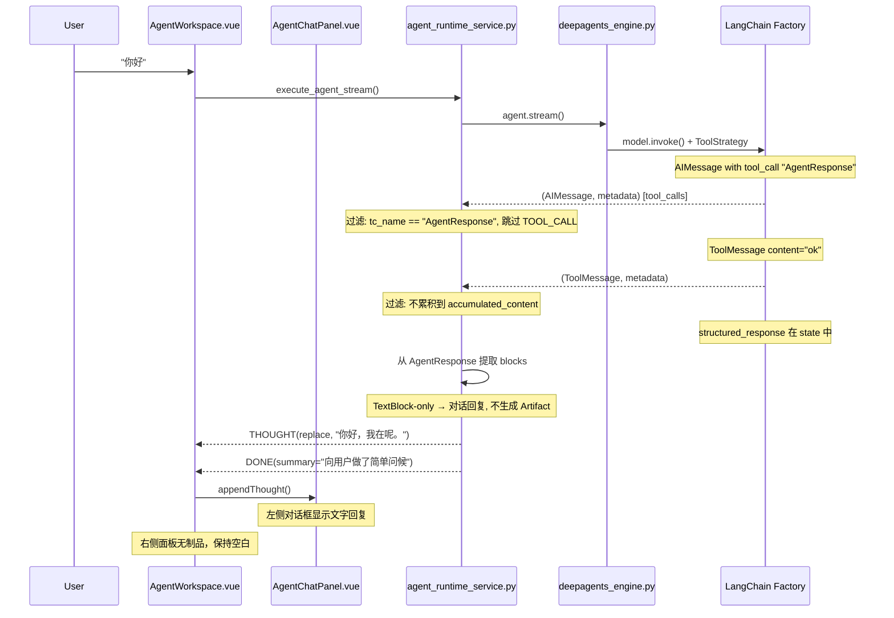

## 产品概述

修复 Agent 对话系统中的三个关联 Bug，均由 ToolStrategy 结构化输出机制的处理缺陷引发。

## 核心问题

1. **TextBlock 对象被原始打印**：Agent 回复"你好"时，对话框和右侧制品面板显示 `Returning structured response: blocks=[TextBlock(type='text', content='你好，我在呢。', sentiment='happy')]` 等 Pydantic repr 字符串，而非渲染实际文本内容
2. **简单对话错误产出制品**：问候式对话不应有制品输出，右侧面板不应展示内容，但当前显示了一个"执行结果"制品
3. **工具状态卡死**：AgentResponse 内部 tool_call 被当作普通工具显示为"执行中"，始终无法变为"已完成"；agent 头部状态也显示"分析中"

## 修复目标

- 简单对话只在左侧对话框显示 Agent 文字回复，右侧面板空白
- 复杂任务正确生成制品（代码/图表/表格），右侧面板正常渲染
- 所有工具调用均有完整 running → completed 生命周期

## 技术栈

- 后端：Python + LangChain + LangGraph（Agent 引擎）
- 前端：Vue 3 + TypeScript（Tauri 桌面应用）
- 流协议：SSE + 自定义 StreamMessage 协议

## 实现方案

### 根因链路分析

LangChain `factory.py` 第1054-1057行的逻辑：

```python
tool_message_content = (
    effective_response_format.tool_message_content
    or f"Returning structured response: {structured_response}"
)
```

当 `tool_message_content` 为 `None`（默认）时，`or` 取右侧，调用 `AgentResponse.__repr__()`，产出 `blocks=[TextBlock(type='text'...)]` 格式字符串。这个 ToolMessage 通过 stream 传递给 `_stream_execution`，被当作普通文本累积到 `accumulated_content`，引发三个 Bug 的连锁反应。

### 修复策略（三层防御）

**第一层 — 源头掐断（deepagents_engine.py）**：

- 设置 `ToolStrategy(schema=AgentResponse, tool_message_content="")` 
- 空字符串依然是 truthy（`"" or ...` 在 Python 中 `""` 是 falsy），所以需要使用一个最小化无害字符串如 `"ok"`
- 实际验证：`"" or "fallback"` 结果是 `"fallback"`。所以用 `tool_message_content="ok"` 或一个短标记

**第二层 — 流处理过滤（agent_runtime_service.py）**：

- 在 `_stream_execution` 中识别并过滤 `AgentResponse` 相关的 tool_call（名称为 `"AgentResponse"`），不发送 TOOL_CALL 事件
- 从 `stream_mode="values"` 获取 `structured_response`，或在 `messages` 模式下识别 `AgentResponse` ToolMessage 并从中提取结构化数据
- 过滤 ToolMessage 中以 `"ok"` 或 `"Returning structured response"` 开头的内容，不累积到 `accumulated_content`

**第三层 — 输出解析增强（agent_runtime_service.py）**：

- `_emit_final_output` 改为接收可选的 `AgentResponse` 对象，直接从结构化数据生成 Artifact
- 对于简单对话（只有 TextBlock、无代码/图表），将文本内容作为 THOUGHT 输出到对话框，不生成 Artifact
- 复杂输出（含 CodeBlock/ChartBlock/TableBlock）才生成 Artifact 到右侧面板

### 关键技术决策

1. **使用 `tool_message_content="ok"` 而非空字符串**：Python 中 `"" or fallback` 会取 fallback，空字符串无效。使用短标记 `"ok"` 确保 LangChain 不生成冗长 repr 文本。

2. **过滤 AgentResponse tool_call 而非通用过滤**：只过滤名称完全匹配 `"AgentResponse"` 的 tool_call，不影响其他正常工具。`_SchemaSpec.__init__` 中 name 取 `schema.__name__` 即 `"AgentResponse"`。

3. **TextBlock-only 响应不生成 Artifact**：判断条件为 `all(block.type == "text" for block in response.blocks)`，此类响应视为"对话回复"，直接拼接 content 输出为 THOUGHT（replace 模式），不创建右侧制品。

4. **保留 accumulated_content 作为 fallback**：当结构化输出提取失败时（如 JSON 回退模式），仍可从累积文本中尝试解析。

## 实现注意事项

- **过滤条件精确性**：ToolMessage 的 `name` 字段为 `"AgentResponse"`（来自 `_SchemaSpec` 的 `schema.__name__`），content 过滤同时检查 `"Returning structured response"` 前缀和 `"ok"` 精确匹配
- **性能**：无额外开销，仅在现有流处理循环中增加条件判断
- **兼容性**：`tool_message_content` 参数已存在于 ToolStrategy API（从源码确认第227行），不涉及 hack
- **回退安全**：如果 LangChain 版本不含此参数，`_stream_execution` 的过滤逻辑仍能兜底

## 架构设计



## 目录结构

```
backend/agent_engine/
├── engine/
│   └── deepagents_engine.py    # [MODIFY] _get_structured_response_format(): 添加 tool_message_content="ok"
└── services/
    └── agent_runtime_service.py # [MODIFY] _stream_execution(): 过滤 AgentResponse tool_call 和 ToolMessage；
                                 #          _emit_final_output(): 支持 AgentResponse 对象直接解析；
                                 #          区分 TextBlock-only（对话）和含 code/chart/table（制品）
```

## 关键代码结构

```python
# agent_runtime_service.py — 核心过滤常量
STRUCTURED_OUTPUT_TOOL_NAMES = {"AgentResponse"}
STRUCTURED_OUTPUT_MARKER = "ok"

# agent_runtime_service.py — 判断是否为纯文本对话（不生成制品）
def _is_conversational_response(response: "AgentResponse") -> bool:
    """判断结构化响应是否为纯对话型（只有 TextBlock）"""
    return all(
        getattr(block, "type", None) == "text" 
        for block in response.blocks
    )
```

## Agent Extensions

### SubAgent

- **code-explorer**
- 用途：在修改 `_stream_execution` 时，跨文件验证 LangChain stream 事件中 message_chunk 的类型字段和属性，确保过滤条件精确
- 预期结果：确认 ToolMessage 在 `stream_mode="messages"` 下的 `type`、`name`、`content` 字段值