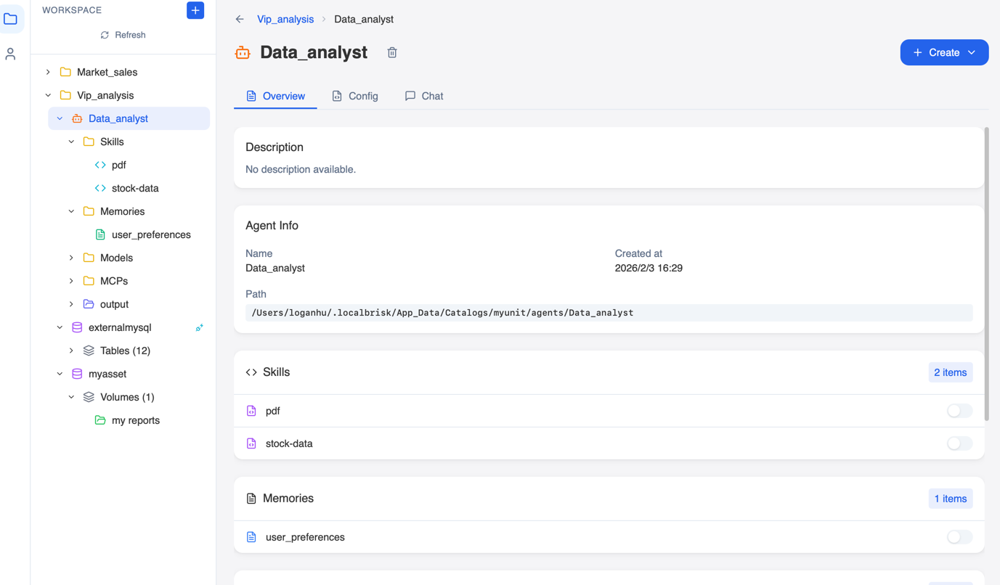

# LocalBrisk — Your Laptop, Your Agent Company

<p align="center">
  <strong>🚀 Early Stage & Actively Evolving — Looking for Founding Contributors to Build the Future of Local AI Together</strong>
</p>

**English** | [中文](README_zh.md) | [Development Guide](DEVELOPMENT.md) | [开发指南](DEVELOPMENT_zh.md)

> **Local-First, Privacy-Safe — Turn your laptop into a fully autonomous AI agent company.**

LocalBrisk is a cross-platform desktop workstation that lets you build, orchestrate, and run AI agents **entirely on your own machine**. Through **ontology modeling**, it unifies local files, cloud databases, and domain knowledge into a single semantic graph that agents can reason over. No data leaves your device, no cloud dependency required — just one app that transforms your laptop into a self-contained AI organization.

### Why LocalBrisk?

- **Local Agent Sandbox**: Every Agent runs inside an isolated local sandbox with its own virtual environment, file system backend, and tool permissions — your code execution and data processing never leave your machine.
- **Federated Local + Remote Analysis**: Analyze local sensitive files alongside cloud databases **without uploading anything**. Local Parquet/CSV/Excel files and remote MySQL/PostgreSQL tables are unified under the same AssetBundle, and the Agent queries them in-place through a federated virtual file system.
- **Unified Ontology for Local & Cloud Data**: Model relationships and actions across local files and cloud data sources in a single `ontology.yaml`. The Agent reasons over the combined ontology graph — no distinction between where data physically resides.
- **Git-Ready Configuration as Code**: All Agent definitions, ontology models, memory prompts, skill packages, and asset bundle configs are **plain YAML/Markdown files** stored under `~/.localbrisk/App_Data/Catalogs/`. No database, no proprietary format — just a directory tree you can `git init`, version-control, branch, and share across teams via any Git hosting service.
- **Your Laptop, Your Agent Company**: Each BusinessUnit represents an organizational unit; within it, multiple Agents assume different roles — data analyst, research assistant, code reviewer, operations monitor. Your single local machine becomes a **self-contained AI agent organization** where specialized agents collaborate, share data assets through the same ontology, and execute cross-functional workflows — all without a cloud backend.

### Business Scenario: E-Commerce Agent Company

> Your laptop is an **Agent Company**. You are the **CEO** — directing every department, managing digital assets, and orchestrating workflows through natural language.
```
🖥️ WORKSPACE (You = CEO)
│
├── 📁 Market_sales                          ── BU: Sales & Marketing Dept
│   ├── 🤖 Sales_analyst                     ── Agent: analyzes order & customer data
│   │   ├── 📁 Skills        (sql_gen, report_builder)
│   │   ├── 📁 Memories       (sales_playbook.md, kpi_definitions.md)
│   │   ├── 📁 Models         (deepseek-chat ✅, gpt-4o)
│   │   ├── 📁 MCPs           (web_search, python_executor)
│   │   └── 📁 output/        ← sandbox workspace (isolated)
│   ├── 🤖 Ad_optimizer                      ── Agent: optimizes ad spend & ROI
│   │   ├── 📁 Skills        (ab_test, channel_analysis)
│   │   ├── 📁 Memories       (campaign_history.md)
│   │   ├── 📁 Models         (qwen-max ✅)
│   │   └── 📁 output/        ← sandbox workspace
│   ├── 🗄️ sales_db          🔌 external     ── AssetBundle: MySQL remote database
│   │   ├── 📊 orders                         (synced table metadata)
│   │   ├── 📊 customers
│   │   ├── 📊 products
│   │   └── 📄 ontology.yaml                  (fk: orders→customers, derived: monthly_revenue)
│   └── 🗄️ marketing_docs       local        ── AssetBundle: local files
│       ├── 📂 campaigns/                      (PDF/PPT campaign decks)
│       ├── 📂 competitor_reports/             (Excel/CSV market data)
│       └── 📊 ad_spend.csv
│
├── 📁 Supply_chain                          ── BU: Supply Chain Dept
│   ├── 🤖 Inventory_mgr                     ── Agent: demand forecasting & stock management
│   │   ├── 📁 Skills        (forecast, reorder_alert)
│   │   ├── 📁 Models         (deepseek-chat ✅)
│   │   └── 📁 output/        ← sandbox workspace
│   ├── 🤖 Logistics_bot                     ── Agent: shipment tracking & route optimization
│   │   ├── 📁 Skills        (tracking, route_calc)
│   │   └── 📁 output/        ← sandbox workspace
│   ├── 🗄️ warehouse_db      🔌 external     ── AssetBundle: PostgreSQL remote database
│   │   ├── 📊 inventory
│   │   ├── 📊 sku_master
│   │   └── 📄 ontology.yaml                  (fk: inventory→sku_master)
│   └── 🗄️ shipping_docs        local        ── AssetBundle: local contracts & routes
│       ├── 📂 contracts/                      (PDF supplier agreements)
│       └── 📊 routes.parquet
│
├── 📁 Finance                               ── BU: Finance Dept
│   ├── 🤖 Finance_analyst                   ── Agent: P&L analysis & financial reporting
│   │   ├── 📁 Skills        (pivot_table, trend_analysis)
│   │   ├── 📁 Models         (gpt-4o ✅)
│   │   └── 📁 output/        ← sandbox workspace
│   ├── 🤖 Tax_assistant                     ── Agent: tax calculation & invoice processing
│   │   ├── 📁 Skills        (tax_calc, invoice_ocr)
│   │   └── 📁 output/        ← sandbox workspace
│   ├── 🗄️ accounting_db     🔌 external     ── AssetBundle: MySQL financial database
│   │   ├── 📊 general_ledger
│   │   ├── 📊 accounts_payable
│   │   ├── 📊 accounts_receivable
│   │   └── 📄 ontology.yaml                  (derived: monthly_pnl ← GL entries)
│   └── 🗄️ tax_docs             local        ── AssetBundle: local tax documents
│       ├── 📂 invoices/                       (scanned invoice PDFs)
│       └── 📊 tax_rates.csv
│
└── 🔧 Shared Infrastructure (invisible to tree, powers everything)
    ├── DuckDB Compute Engine                  (cross-BU SQL analytics)
    ├── LLM Gateway                            (OpenAI / DeepSeek / local models)
    └── Git-versioned Catalogs/                (all configs = plain YAML/MD files)
```

| Concept | In LocalBrisk | In This Scenario |
|---------|---------------|------------------|
| **You** | WORKSPACE operator | CEO — directs all departments via natural language |
| **BusinessUnit** | Top-level org folder | Department: Sales, Supply Chain, Finance |
| **Agent** | AI employee with own sandbox | Role: Sales Analyst, Inventory Mgr, Tax Assistant... |
| Agent sub-resources | Skills / Memories / Models / MCPs / output | Each agent's capabilities, knowledge, LLM config, and isolated workspace |
| **AssetBundle** | Data asset collection | Dept data: remote DB tables (🗄️ external) + local files (📂 local) |
| **Ontology** | `ontology.yaml` in each bundle | Semantic relationships & actions across all assets |

**Key points:**
- **You = CEO**: Click any Agent to open a Chat and direct it with natural language — no coding required.
- **BusinessUnit = Department**: Each BU is an organizational boundary with its own staff (Agents) and data (AssetBundles).
- **Agent = Employee Role**: Each Agent has specialized skills, dedicated memories, and its own model — like hiring a domain expert.
- **Federated Data**: External bundles (remote DB) and local bundles (your files) coexist side-by-side — the Agent queries both in-place, **zero data upload**.
- **Sandbox Isolation**: Each Agent's `output/` is a private workspace; shared assets are mounted read-only.
- **Ontology Bridges Everything**: `ontology.yaml` defines how tables relate, where metrics come from, and what actions to trigger — the Agent reasons over the full graph.

---

## Product Positioning

| Keyword | Description |
|---------|-------------|
| **Fully Local** | Physical data isolation, local model inference, zero privacy risk |
| **Local Agent Sandbox** | Each Agent runs in an isolated sandbox (venv + CompositeBackend), code execution and file I/O stay on-device |
| **Federated Analysis** | Query local files and remote databases together — sensitive data never leaves your machine |
| **Unified Ontology** | One semantic model spans local & cloud assets; Agent reasons across the full knowledge graph |
| **Unified Asset Management** | Three-tier architecture: BusinessUnit → Agent / AssetBundle → Leaf Assets |
| **One-Click Install** | Minimal installer with built-in lightweight inference engine, no complex setup |
| **Multi-Model Support** | OpenAI / Claude / Qwen / DeepSeek / Gemini / Zhipu / Moonshot APIs + local models |
| **Agent-as-a-Service** | Each Agent has its own Memory, Skills, Models, and MCP (Tools), with streaming dialogue and multi-step reasoning |
| **Local Agent Company** | Each BusinessUnit is an org unit with role-specialized Agents — your laptop becomes a self-contained AI company |

---

## Architecture Overview

```
┌─────────────────────────────────────────────────────────────────┐
│                    Desktop (macOS / Windows / Linux)              │
│                                                                  │
│  ┌──────────────┐   Tauri IPC   ┌──────────────┐               │
│  │  Vue 3 UI    │◄────────────►│  Rust Tauri   │               │
│  │  :1420        │              │  Main Process  │               │
│  └──────┬───────┘              └──────┬───────┘               │
│         │ HTTP / SSE                   │ Sidecar spawn/kill     │
│         ▼                              ▼                        │
│  ┌─────────────────────────────────────────────┐               │
│  │         Python FastAPI Backend  :8765         │               │
│  │  ┌───────────┐ ┌───────────┐ ┌────────────┐ │               │
│  │  │  Business  │ │  Agent    │ │  Compute   │ │               │
│  │  │  Services  │ │  Engine   │ │  Engine    │ │               │
│  │  │  (CRUD)   │ │(LangGraph)│ │ (DuckDB)   │ │               │
│  │  └───────────┘ └───────────┘ └────────────┘ │               │
│  └─────────────────────────────────────────────┘               │
│                         │                                        │
│                         ▼                                        │
│  ┌─────────────────────────────────────────────┐               │
│  │   ~/.localbrisk/App_Data/Catalogs/ (FS)       │  ◄── Git-ready│
│  │     ├── {bu}/agents/       (YAML + MD)        │      plain    │
│  │     ├── {bu}/asset_bundles/ (YAML)            │      files    │
│  │     └── ontology.yaml                         │               │
│  │   ~/.localbrisk/localbrisk.db (DuckDB)        │               │
│  └─────────────────────────────────────────────┘               │
└─────────────────────────────────────────────────────────────────┘
```

> **Configuration as Code**: The entire `Catalogs/` directory is composed of plain YAML and Markdown files — no proprietary binary formats. You can `git init` this directory to version-control Agent definitions, ontology models, memory prompts, and skill packages, then push to any Git remote for team sharing and collaboration.

### Three-Layer Collaboration

| Layer | Tech Stack | Responsibility |
|-------|-----------|----------------|
| **UI** | Vue 3 + Vite + Tailwind CSS + Radix-Vue + vue-i18n + CodeMirror + ECharts + Mermaid | Responsive UI, config editing, data visualization, document preview |
| **Desktop Shell** | Tauri 2.0 (Rust) | Window management, native menus, Sidecar process scheduling, file operations, settings persistence |
| **Backend** | Python FastAPI + LangGraph + LangChain + DeepAgents + Polars + DuckDB | AI Agent engine, data compute, asset management, model gateway |

### Packaging & Distribution

- **Python backend** → PyInstaller bundles into a single executable
- **Full application** → Tauri Bundler outputs `.app` / `.dmg` (macOS), `.msi` / `.exe` (Windows), `.AppImage` / `.deb` (Linux)

---

## Domain Model

```
BusinessUnit
├── Agent
│   ├── memories/          # Memory / prompts (.md)
│   ├── skills/            # Skill directory
│   ├── models/            # Model configs (.yaml) — local or API endpoint
│   ├── mcps/              # MCP tool configs — Python function / MCP Server / Remote API
│   └── output/            # Work records & conversation history
│       ├── .conversation_history/
│       ├── .checkpoints/
│       └── {session}/
└── AssetBundle (local | external)
    ├── tables/            # Table mappings (Parquet / CSV / JSON / Delta / Remote DB)
    ├── volumes/           # Document storage (local / S3)
    ├── functions/         # Custom functions
    ├── notes/             # Notes
    └── ontology.yaml      # Ontology definition — asset relationships & executable actions
```

All configurations are persisted as YAML files (`config.yaml`, `agent_spec.yaml`, `bundle.yaml`, `ontology.yaml`). **Directory-as-model** design makes version control and import/export straightforward.

### Ontology Modeling

Data assets (Tables, Volumes, Functions) are organized only by directory hierarchy, lacking **lateral relationship expression**. The Ontology layer introduces semantic modeling at the AssetBundle level, enabling Agents to understand data relationships and automatically orchestrate actions.

#### Design Concept

```
                    ┌─────────────┐
                    │  Ontology   │  ← Semantic layer (relationships + actions)
                    └──────┬──────┘
           ┌───────────────┼───────────────┐
           ▼               ▼               ▼
      ┌─────────┐    ┌─────────┐    ┌───────────┐
      │  Table   │    │ Volume  │    │ Function  │
      │ (Data)   │◄──►│ (Docs)  │◄──►│ (Action)  │
      └─────────┘    └─────────┘    └───────────┘
```

- **Entity**: Semantic annotation of existing assets (type, role, domain)
- **Relationship**: Connections between entities (foreign key, derivation, dependency, reference)
- **Action**: Executable operations bound to entities or relationships (Function / SQL / Agent Skill)

#### Physical Storage

Ontology definitions are stored as `ontology.yaml` in the AssetBundle root:

```
asset_bundles/{bundle_name}/
├── bundle.yaml
├── ontology.yaml          # Ontology definition file
├── tables/
├── functions/
└── volumes/
```

#### ontology.yaml Example

```yaml
# AssetBundle Ontology Definition
version: "1.0"
namespace: "financial_research"

# ==================== Entity Declarations ====================
entities:
  - name: orders                        # References tables/orders.yaml
    asset_type: table
    semantic_type: fact_table            # fact_table / dimension / metric / document / function
    domain: sales
    description: "Order transaction fact table"

  - name: customers
    asset_type: table
    semantic_type: dimension
    domain: crm
    description: "Customer dimension table"

  - name: products
    asset_type: table
    semantic_type: dimension
    domain: product

  - name: monthly_revenue
    asset_type: table
    semantic_type: metric
    domain: finance
    description: "Monthly revenue summary metric table"

  - name: calculate_growth_rate
    asset_type: function
    semantic_type: function
    domain: finance
    description: "Calculate YoY/MoM growth rate"

  - name: q4_report
    asset_type: volume
    semantic_type: document
    domain: finance

# ==================== Relationship Definitions ====================
relationships:
  - name: order_customer_fk
    type: foreign_key                    # foreign_key / derived_from / depends_on / references / contains
    source: orders
    target: customers
    properties:
      source_column: customer_id
      target_column: id
      join_type: left

  - name: order_product_fk
    type: foreign_key
    source: orders
    target: products
    properties:
      source_column: product_id
      target_column: id

  - name: revenue_derived_from_orders
    type: derived_from
    source: monthly_revenue
    target: orders
    properties:
      aggregation: "SUM(amount) GROUP BY month"
      schedule: daily

  - name: growth_rate_depends_on_revenue
    type: depends_on
    source: calculate_growth_rate
    target: monthly_revenue

  - name: report_references_revenue
    type: references
    source: q4_report
    target: monthly_revenue

# ==================== Action Definitions ====================
actions:
  - name: refresh_monthly_revenue
    description: "Refresh monthly revenue summary"
    trigger: manual | schedule | on_change
    target_entity: monthly_revenue
    action_type: sql                          # sql / function / skill / pipeline
    action_config:
      sql: |
        INSERT INTO monthly_revenue
        SELECT DATE_TRUNC('month', order_date) AS month,
               SUM(amount) AS revenue
        FROM orders
        GROUP BY 1

  - name: calc_yoy_growth
    description: "Calculate year-over-year growth rate"
    trigger: manual
    target_entity: monthly_revenue
    action_type: function
    action_config:
      function_ref: calculate_growth_rate
      parameters:
        metric_column: revenue
        time_column: month
        period: year

  - name: validate_order_customer_integrity
    description: "Validate order-customer referential integrity"
    trigger: on_change
    target_relationship: order_customer_fk
    action_type: sql
    action_config:
      sql: |
        SELECT o.id, o.customer_id
        FROM orders o
        LEFT JOIN customers c ON o.customer_id = c.id
        WHERE c.id IS NULL
```

#### Relationship Types

| Type | Meaning | Typical Scenario |
|------|---------|-----------------|
| `foreign_key` | Foreign key reference, join path between tables | orders.customer_id → customers.id |
| `derived_from` | Derivation / computation source | Metric table aggregated from fact table |
| `depends_on` | Execution dependency | Function requires a table as input |
| `references` | Content reference | Document/note references a data table |
| `contains` | Containment / nesting | Volume contains multiple sub-documents |

#### Action Types

| Type | Description | Execution |
|------|------------|-----------|
| `sql` | SQL script | Executed via DuckDB Compute Engine |
| `function` | Custom function | References Python function under functions/ |
| `skill` | Agent skill | Invokes Agent's Skill |
| `pipeline` | Multi-step orchestration | Executes multiple actions in sequence |

#### How Agents Leverage Ontology

1. **Auto-discover Join Paths**: Agent infers multi-table SQL joins via `foreign_key` relationships
2. **Understand Data Lineage**: Traces metric sources via `derived_from` to answer "how was this data computed?"
3. **Smart Action Orchestration**: Agent auto-orders execution steps based on `depends_on` relationships
4. **Knowledge Linking**: Connects documents with data via `references` to answer "which reports use this table?"

---

## Project Structure

```
LocalBrisk/
├── frontend/                   # Vue 3 Frontend
│   ├── src/
│   │   ├── views/              # HomeView (single page: nav + tree + detail)
│   │   ├── components/
│   │   │   ├── catalog/        # Catalog panel, create dialogs
│   │   │   ├── detail/         # Agent/Model/Table/Volume/Skill/Memory detail panels
│   │   │   ├── common/         # Shared components (Dialog/Form/Toast/ConfigEditor)
│   │   │   ├── viewer/         # File viewers (Markdown/PDF/Office/Excel/Image)
│   │   │   ├── layout/         # Navigation buttons
│   │   │   └── settings/       # Settings & About dialogs
│   │   ├── services/           # API (Python backend) + Tauri IPC + File service
│   │   ├── stores/             # State management (businessUnitStore + artifactStore)
│   │   ├── composables/        # Composition functions (SSE/Form/Async/Config/FileBrowser/Toast)
│   │   ├── types/              # TypeScript types (domain model/runtime/stream protocol)
│   │   └── i18n/               # Internationalization (zh-CN, en, zh-TW, ja)
│   └── package.json
│
├── src-tauri/                  # Tauri Desktop Shell (Rust)
│   ├── src/
│   │   ├── main.rs             # Entry: plugin registration + menu + Sidecar
│   │   ├── backend.rs          # Sidecar process management (start/health check/stop)
│   │   ├── commands.rs         # Tauri commands (app info/settings)
│   │   ├── file_ops.rs         # File operation commands
│   │   ├── menu.rs             # Native menu
│   │   └── settings.rs         # Settings persistence
│   ├── binaries/               # Packaged Python backend executable
│   └── tauri.conf.json         # Window/bundle/permission config
│
├── backend/                    # Python FastAPI Backend
│   ├── main.py                 # FastAPI entry (port 8765)
│   ├── run.py                  # PyInstaller entry
│   ├── app/
│   │   ├── api/endpoints/      # REST API endpoints
│   │   │   ├── business_unit   # BusinessUnit full CRUD
│   │   │   ├── agent_runtime   # Agent streaming execution (SSE)
│   │   │   ├── model_runtime   # Model direct execution
│   │   │   ├── llm_providers   # LLM provider catalog
│   │   │   ├── compute_engine  # DuckDB SQL execution
│   │   │   └── health          # Health check
│   │   ├── core/               # Config/Logging/i18n/Middleware/Constants
│   │   ├── models/             # Pydantic data models
│   │   └── services/           # Business service layer + DB connectors
│   ├── agent_engine/           # AI Agent Engine
│   │   ├── core/               # Stream protocol (StreamMessage), config models
│   │   ├── engine/             # DeepAgentsEngine (LangGraph)
│   │   ├── services/           # AgentRuntimeService (lifecycle management)
│   │   ├── llm/                # LLMClientFactory + Provider registry
│   │   └── tools/              # Runtime toolset
│   ├── compute_engine/         # DuckDB compute service
│   └── tests/                  # Unit tests
│
├── build.sh / build.bat        # One-click build scripts
├── dev.sh                      # Development launch script
└── DEVELOPMENT.md              # Development guide
```

---

## Core Features

### Local Agent Sandbox

- Each Agent runs inside an **isolated local sandbox** — dedicated Python venv, file system backend (`CompositeBackend`), and tool permission boundaries
- Code execution (`LocalShellBackend`) is confined to the Agent's `output/` directory; skills, memories, and asset volumes are mounted as **read-only virtual paths**
- All intermediate results, conversation history, and checkpoints persist locally — nothing is sent to any cloud service
- Sandbox environment variables and PATH are fully isolated per Agent

### Federated Local + Remote Analysis

- **No upload required**: local sensitive files (Parquet / CSV / Excel) and remote databases (MySQL / PostgreSQL / DuckDB) are unified under the same AssetBundle
- The Agent accesses local volumes and remote tables through a **federated virtual file system** (`CompositeBackend` routes) — identical API, no data movement
- Query local Excel + remote MySQL in a single Agent conversation, with DuckDB as the local analytical engine
- External database metadata is synced locally as YAML; the actual query is proxied on-demand — raw data never leaves its source

### Agent Chat

- Each Agent has independent models, memories, skills, and MCP tools
- Streaming execution (SSE) with real-time rendering of thought process, task lists, and artifacts
- Reconnection snapshot recovery
- Conversation history persisted locally

### Unified Asset Management

- Manage multiple AssetBundles (local/external data sources) under each BusinessUnit
- MySQL / PostgreSQL / SQLite / DuckDB external connections with metadata sync
- Table data preview, document viewers (PDF/Office/Markdown/Excel)
- Skills imported as zip packages, Memories edited as Markdown

### Ontology Modeling — Unified Local & Cloud

- Define semantic relationships between **local files and cloud data sources** in a single `ontology.yaml` — the Agent sees one unified knowledge graph regardless of where data physically resides
- **Five relationship types**: foreign_key, derived_from, depends_on, references, contains
- **Four action types**: SQL script, custom function, Agent skill, multi-step pipeline
- Agent runtime auto-loads ontology for join path inference, data lineage tracing, and smart action orchestration
- Actions support manual, scheduled, and on-change triggers

### Local Compute Engine

- DuckDB embedded analytical database for SQL query execution returning tabular data
- Execution history audit trail
- Query SQL safety constraints (SELECT/WITH/SHOW/DESCRIBE/PRAGMA only)

### Multi-Model Support

| Type | Supported Providers |
|------|-------------------|
| API Endpoint | OpenAI, Claude, Qwen, Baidu Qianfan, Gemini, DeepSeek, Zhipu, Moonshot |
| Local Model | Qwen, DeepSeek, Llama, Mistral, ChatGLM, Baichuan, InternLM (planned) |

### Internationalization

Both frontend and backend support 4 languages: Simplified Chinese (default), English, Traditional Chinese, Japanese

---

## Getting Started

### Prerequisites

- **Node.js** >= 18
- **Rust** >= 1.70
- **Python** >= 3.10

### Install Dependencies

```bash
# Frontend dependencies
cd frontend && npm install && cd ..

# Python backend dependencies
cd backend
python3 -m venv venv
source venv/bin/activate   # Windows: venv\Scripts\activate
pip install -r requirements.txt
cd ..
```

### Development Mode

```bash
# One-click start (Python backend + Tauri frontend)
./dev.sh

# Backend only
./dev.sh --backend-only

# Frontend only
./dev.sh --frontend-only

# Update Python dependencies before starting
./dev.sh --update-deps
```

Frontend runs at `http://localhost:1420`, backend at `http://127.0.0.1:8765`.

### Build for Release

```bash
# One-click: PyInstaller → Sidecar → Tauri Build
./build.sh        # macOS/Linux
build.bat         # Windows
```

Build artifacts:

| Platform | Output Path |
|----------|------------|
| macOS | `src-tauri/target/release/bundle/macos/` and `dmg/` |
| Windows | `src-tauri/target/release/bundle/msi/` and `nsis/` |
| Linux | `src-tauri/target/release/bundle/appimage/` and `deb/` |

---

## API Overview

Backend provides RESTful APIs via FastAPI. Swagger docs available at `http://127.0.0.1:8765/docs` in dev mode.

| Route Prefix | Description |
|-------------|-------------|
| `/health` | Health check & readiness probe |
| `/api/business_units` | BusinessUnit and sub-resource CRUD |
| `/api/runtime/{bu}/agents/{agent}` | Agent load / stream execute / status / cancel / unload |
| `/api/runtime/{bu}/agents/{agent}/models/{model}` | Model load / execute / stream execute |
| `/api/llm` | LLM provider and model catalog |
| `/api/compute` | DuckDB SQL execution |
| `/api/i18n/locales` | Supported languages list |

---

## Communication Channels

| Channel | Purpose |
|---------|---------|
| **HTTP (Fetch)** | Frontend ↔ Python backend (business APIs, model calls) |
| **SSE (Server-Sent Events)** | Agent/Model streaming execution: THOUGHT/TASK_LIST/ARTIFACT/STATUS/ERROR/DONE |
| **Tauri IPC (invoke)** | Frontend ↔ Rust main process (app info, file operations, settings) |
| **Sidecar** | Rust main process → Python backend (process start/stop, health check) |

### StreamMessage Protocol

Each message from Agent execution is a `StreamMessage` with a type field for frontend rendering:

| Type | Rendering Area |
|------|---------------|
| `THOUGHT` | Left panel — thought process (typewriter effect) |
| `TASK_LIST` | Left panel — task list |
| `ARTIFACT` | Right panel — artifact display |
| `STATUS` | Transient status notification |
| `ERROR` | Error message |
| `DONE` | Execution complete |

---

## Data Storage

| Storage Type | Path | Purpose |
|-------------|------|---------|
| File System (YAML + Directories) | `~/.localbrisk/App_Data/Catalogs/` | BusinessUnit, Agent, AssetBundle configs & assets |
| DuckDB | `~/.localbrisk/localbrisk.db` | Compute engine, SQL execution history |
| Tauri Store | App data directory | User settings (language, keep backend alive, etc.) |
| Logs | `~/Library/Logs/LocalBrisk/app.log` | Backend daily rolling logs (7-day retention) |

---

## Design Language

**"Clear & Float"**

- Pure white (#FFFFFF) main cards + light gray (#F5F5F7) background
- Global 12px border radius
- Subtle floating shadow (shadow-sm)
- Dark gray text (#333333), Microsoft YaHei / Segoe UI

---

## Roadmap

| Phase | Goal |
|-------|------|
| Phase 1 | Framework setup, YAML config & i18n integration |
| Phase 2 | Three-tier recursive discovery (BusinessUnit → Agent/AssetBundle → Assets) |
| Phase 3 | Polars + LangGraph unified asset access, Agent streaming execution |
| Phase 4 | Visual polish, local model support, i18n refinement |
| Phase 5 | Ontology Modeling — semantic data relationships, Action engine, Agent auto-orchestration |
| Phase 6 | Local Agent Company — multi-Agent collaboration within a BusinessUnit, role-based task delegation, cross-Agent workflow orchestration |

---

## License

This project is licensed under the [Apache License 2.0](LICENSE).

Copyright © 2026 LocalBrisk Contributors.
