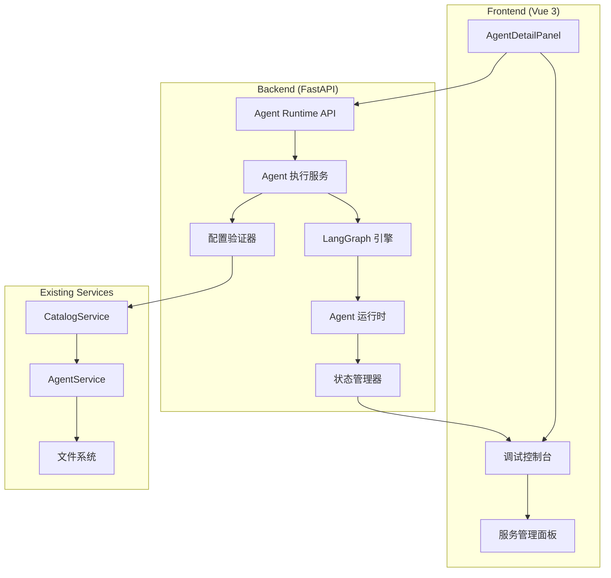

## 用户需求

基于现有的 LocalBrisk 桌面应用（Python+Tauri+Vue 架构），实现用户自定义本地 Agent 系统的完整工作流：

1. 用户基于 agent_spec.yaml 配置模板配置 Agent
2. 配置完成后进行调试运行，验证 Agent 功能
3. 运行测试通过后，发布为常驻服务
4. 使用 LangGraph 作为底层 Agent 执行框架

## 产品概述

在现有 LocalBrisk 系统基础上，新增 Agent 运行时引擎模块，实现从配置、调试到部署的完整 Agent 生命周期管理。系统将支持多 Agent 协作、动态调度、技能管理等高级功能。

## 核心功能

- Agent 配置验证与解析（基于 agent_spec.yaml 规范）
- Agent 运行时调试环境（实时日志、状态监控）
- Agent 执行引擎（LangGraph 集成）
- Agent 服务发布与管理（常驻服务模式）
- 多 Agent 协作与动态调度
- 技能与提示词管理
- 运行状态监控与日志管理

## 技术栈选择

基于现有项目架构，复用以下技术栈：

- **后端框架**: Python FastAPI（已有完整架构）
- **Agent 引擎**: LangGraph（优先选择，生态成熟）
- **前端框架**: Vue 3 + TypeScript + Tailwind CSS（现有技术栈，无需修改）
- **桌面框架**: Tauri 2.0 + Rust（现有架构）
- **数据处理**: Polars + DuckDB（现有依赖）
- **配置解析**: PyYAML（Python端）

## 实现方案

### 核心策略

在现有 `backend/agent_engine/` 模块基础上，构建完整的 Agent 运行时系统。采用分层架构：配置层（YAML解析）→ 编排层（LangGraph集成）→ 执行层（Agent运行时）→ 监控层（状态管理）。

### 关键技术决策

1. **Agent 引擎选择**: 选择 LangGraph 而非 DeepAgents，因为 LangGraph 具有更成熟的生态系统、更好的状态管理和更灵活的工作流编排能力
2. **运行模式设计**: 支持调试模式（同步执行，实时日志）和服务模式（异步执行，后台运行）两种运行模式
3. **配置验证策略**: 基于现有 Pydantic 模型进行 agent_spec.yaml 配置的强类型验证，确保配置正确性
4. **多 Agent 协作**: 利用 LangGraph 的图结构特性实现 Agent 间的动态调度和状态传递

### 实现细节

**性能优化**:

- Agent 实例采用单例模式，避免重复初始化开销
- 使用异步 I/O 处理 Agent 间通信，提升并发性能
- 实现 Agent 状态缓存机制，减少重复计算

**日志管理**:

- 复用现有的 FastAPI 日志系统，按 Agent 实例分离日志流
- 实现结构化日志输出，支持日志级别过滤和实时查看
- 避免敏感信息泄露，对输入输出进行脱敏处理

**容错设计**:

- 实现 Agent 执行的超时控制和异常恢复机制
- 支持 Agent 配置热重载，无需重启服务
- 提供 Agent 执行的回滚和重试机制

## 架构设计

### 系统架构

基于现有 LocalBrisk 架构，在 `backend/agent_engine/` 模块中实现 Agent 运行时系统：



### 模块划分

- **配置管理模块**: agent_spec.yaml 解析、验证、热重载
- **执行引擎模块**: LangGraph 集成、Agent 实例管理
- **调度管理模块**: 多 Agent 协作、动态路由
- **监控管理模块**: 状态跟踪、日志收集、性能监控
- **服务管理模块**: 常驻服务、生命周期管理

### 数据流设计

用户配置 agent_spec.yaml → 配置验证 → LangGraph 图构建 → Agent 实例化 → 执行调度 → 状态更新 → 前端展示

## 目录结构

基于现有项目结构，主要在 `backend/agent_engine/` 目录下实现新功能：

```
backend/agent_engine/
├── __init__.py                    # [MODIFY] 模块初始化，导出核心类和函数
├── core/
│   ├── __init__.py               # [NEW] 核心模块初始化
│   ├── config.py                 # [NEW] Agent 配置模型定义。基于现有 Pydantic 模型扩展，实现 agent_spec.yaml 配置的强类型验证和序列化
│   ├── exceptions.py             # [NEW] Agent 异常定义。定义 AgentConfigError、AgentExecutionError 等专用异常类，提供详细的错误信息和处理建议
│   └── types.py                  # [NEW] Agent 运行时类型定义。定义 AgentState、ExecutionResult、AgentMessage 等核心数据结构
├── engine/
│   ├── __init__.py               # [NEW] 引擎模块初始化
│   ├── langgraph_engine.py       # [NEW] LangGraph 引擎实现。集成 LangGraph 框架，实现 Agent 图构建、状态管理和执行调度
│   ├── agent_runtime.py          # [NEW] Agent 运行时管理。实现 Agent 实例生命周期管理、执行上下文管理和资源清理
│   └── scheduler.py              # [NEW] Agent 调度器。实现多 Agent 协作调度、动态路由和负载均衡
├── services/
│   ├── __init__.py               # [NEW] 服务模块初始化
│   ├── agent_executor.py         # [NEW] Agent 执行服务。提供 Agent 执行的核心服务，包括同步/异步执行、状态跟踪和结果处理
│   ├── config_validator.py       # [NEW] 配置验证服务。实现 agent_spec.yaml 配置的语法验证、语义检查和兼容性验证
│   ├── debug_service.py          # [NEW] 调试服务。提供 Agent 调试功能，包括断点设置、单步执行和状态检查
│   └── daemon_service.py         # [NEW] 守护进程服务。实现 Agent 的常驻服务模式，包括自动启动、健康检查和故障恢复
├── monitoring/
│   ├── __init__.py               # [NEW] 监控模块初始化
│   ├── logger.py                 # [NEW] Agent 日志管理。实现分级日志、结构化输出和实时日志流
│   ├── metrics.py                # [NEW] 性能指标收集。收集 Agent 执行时间、内存使用、成功率等关键指标
│   └── state_tracker.py          # [NEW] 状态跟踪器。实时跟踪 Agent 执行状态、上下文变化和异常情况
└── utils/
    ├── __init__.py               # [NEW] 工具模块初始化
    ├── yaml_parser.py            # [NEW] YAML 解析工具。提供 agent_spec.yaml 配置文件的解析、验证和格式化功能
    └── graph_builder.py          # [NEW] 图构建工具。基于 Agent 配置构建 LangGraph 执行图的工具函数

backend/app/api/endpoints/
├── agent_runtime.py              # [NEW] Agent 运行时 API。提供 Agent 启动、停止、状态查询等运行时管理接口
└── agent_debug.py                # [NEW] Agent 调试 API。提供调试模式启动、日志查看、状态监控等调试相关接口
```

## 关键代码结构

### Agent 运行时配置模型

```python
# backend/agent_engine/core/config.py
from pydantic import BaseModel, Field
from typing import List, Optional, Dict, Any
from app.models.catalog import AgentLLMConfig, AgentInstruction, AgentRouting, AgentCapabilities

class AgentRuntimeConfig(BaseModel):
    """Agent 运行时配置"""
    baseinfo: Dict[str, Any]
    llm_config: AgentLLMConfig
    instruction: AgentInstruction
    routing: AgentRouting
    capabilities: AgentCapabilities
    governance: Dict[str, Any]
    
    # 运行时扩展配置
    debug_mode: bool = Field(False, description="调试模式")
    max_execution_time: int = Field(300, description="最大执行时间（秒）")
    enable_logging: bool = Field(True, description="启用日志")
```

### Agent 执行接口

```python
# backend/agent_engine/services/agent_executor.py
from abc import ABC, abstractmethod
from typing import Dict, Any, AsyncGenerator
from ..core.config import AgentRuntimeConfig
from ..core.types import ExecutionResult

class AgentExecutor(ABC):
    @abstractmethod
    async def execute(self, config: AgentRuntimeConfig, input_data: Dict[str, Any]) -> ExecutionResult:
        """执行 Agent"""
        pass
    
    @abstractmethod
    async def debug_execute(self, config: AgentRuntimeConfig, input_data: Dict[str, Any]) -> AsyncGenerator[Dict[str, Any], None]:
        """调试模式执行 Agent"""
        pass
```

### LangGraph 集成接口

```python
# backend/agent_engine/engine/langgraph_engine.py
from langgraph import StateGraph
from typing import Dict, Any
from ..core.config import AgentRuntimeConfig

class LangGraphEngine:
    def build_graph(self, config: AgentRuntimeConfig) -> StateGraph:
        """基于配置构建 LangGraph 执行图"""
        pass
    
    async def execute_graph(self, graph: StateGraph, input_data: Dict[str, Any]) -> Dict[str, Any]:
        """执行 LangGraph 图"""
        pass
```

## 推荐的代理扩展

### Skill

- **skill-creator**
- 目的：指导创建 Agent 技能开发和管理的专用技能模块
- 预期结果：建立标准化的技能创建、验证和集成流程，支持用户自定义技能的动态加载